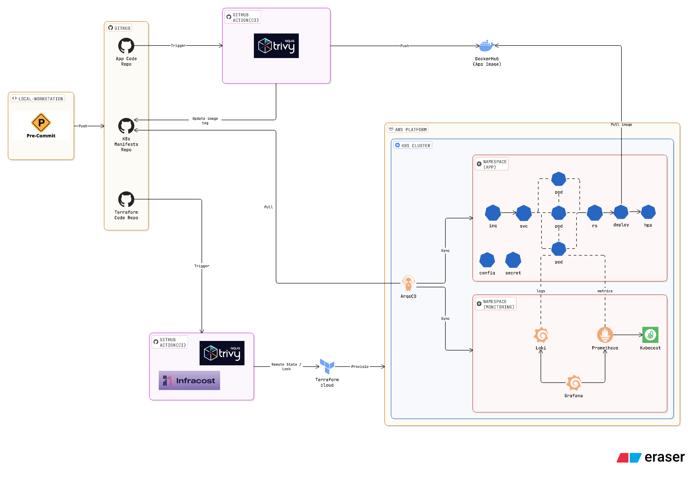

# GitOps Platform Services

> GitOps delivery platform built with ArgoCD and Kubernetes.
>
> This repository manages Kubernetes workloads and platform services through declarative GitOps workflows. It serves as the deployment layer for the local platform that powers the Japanese Academy application.

---

## Overview

This repository contains the Kubernetes manifests, Helm values, ArgoCD Applications, and supporting scripts required to operate the local GitOps stack.

Application deployment and platform services are managed through a dedicated app-of-apps structure under `gitops/`, while bootstrap resources and helper scripts live in `bootstrap/` and the repository root.

Although the repository name is still `argocd-local`, it now covers both local and AWS-style production setups. The name was kept unchanged because other repositories and CI/GitOps paths are sensitive to repository names and folder structure.

The repository was intentionally designed to separate infrastructure provisioning (Terraform), platform operations (GitOps), and application development (Flask) into independent repositories following separation-of-concerns principles.

The environment is controlled from `gitops/root-app/values.yaml` through `env.stage`, which switches the root app between `local` and `prod` values.

The design follows GitOps principles where Git acts as the single source of truth for Kubernetes operations.

---

## Architecture



### Key Components

* ArgoCD
* App-of-Apps pattern
* Argo Rollouts
* Kube Prometheus Stack
* Loki
* Kubecost
* Japanese Academy application
* Bootstrap manifests and helper scripts

### Architecture Highlights

* Local GitOps control plane managed from `gitops/root-app`
* Observability stack deployed as separate ArgoCD Applications
* Progressive delivery enabled through Argo Rollouts blue-green strategy
* Single repository supporting both local and production environments through environment-specific Helm values
* Production-style and local configuration split through Helm values
* Helper scripts for setup, port-forwarding, and cleanup

---

## Design Goals

This project was built to demonstrate a practical local GitOps platform for development and portfolio use.

Key objectives included:

* Declarative application delivery
* Clear separation between platform services and application workloads
* Observability for local Kubernetes workloads
* Progressive delivery with preview and promotion flow
* Reusable environment-specific configuration
* Easy bootstrap and teardown for local cluster experiments

---

## Platform Components

### GitOps Layer

* ArgoCD root application
* App-of-apps structure
* Automated synchronization
* Declarative deployments

### Application Layer

* Japanese Academy Flask web app
* Local and production values files
* Rollout-based deployment strategy
* Database and secret configuration

### Observability Layer

* kube-prometheus-stack
* Grafana dashboards
* Loki logging stack
* Application and platform visibility

### Cost Management Layer

* Kubecost wrapper chart
* Cluster cost visibility
* Namespace-level analysis

### Bootstrap and Utilities

* `setup.sh`
* `cleanup.sh`
* `port-forward.sh`
* `clusterip-access.sh`
* `bootstrap/` resources

---

## Security Highlights

### Declarative Configuration

GitOps-managed manifests reduce manual drift and make platform state reviewable through pull requests and commits.

### Secret Handling

For production deployments, application secrets are retrieved through AWS Secrets Manager and IAM Roles for Service Accounts (IRSA).

Local environments use simplified bootstrap configurations to keep development workflows lightweight.

### Environment Separation

Local and production-style settings are separated through values files such as `values.yaml` and `values-prod.yaml`.

---

## GitOps Design

This repository is the GitOps delivery layer for the platform.

The platform uses the ArgoCD App-of-Apps pattern.

A single root application manages platform services and application workloads, allowing environment-wide synchronization through a central entry point.

Benefits include:

* Simplified onboarding
* Centralized application management
* Consistent deployment structure
* Easier environment promotion

The GitOps layer manages:

* ArgoCD
* Argo Rollouts
* Kube Prometheus Stack
* Loki
* Kubecost
* Japanese Academy application workloads

This separation keeps application delivery and platform operations under a consistent declarative workflow.

---

## Repository Structure

```text
.
├── argocd/
├── bootstrap/
├── docs/
├── gitops/
├── cleanup.sh
├── clusterip-access.sh
├── port-forward.sh
└── setup.sh
```

### Directory Description

| Directory | Purpose |
| --------- | ------- |
| `argocd/` | ArgoCD values and installation configuration |
| `bootstrap/` | Cluster bootstrap manifests and repo secret helpers |
| `docs/` | Architecture images and supporting documentation |
| `gitops/` | App-of-apps root chart and workload charts |

---

## Related Repositories

| Repository | Purpose | Link |
| ---------- | ------- | ---- |
| argocd-local | GitOps delivery platform and Kubernetes services | [github.com/yuemanwai/argocd-local](https://github.com/yuemanwai/argocd-local) |
| japanese-academy | Flask web application | [github.com/yuemanwai/japanese-academy](https://github.com/yuemanwai/japanese-academy) |
| terraform | AWS infrastructure provisioning layer | [github.com/yuemanwai/terraform](https://github.com/yuemanwai/terraform) |

---

## Technologies

ArgoCD • Kubernetes • Helm • Argo Rollouts • Prometheus • Grafana • Loki • Kubecost • Flask • Terraform integration

---

## Notes

This repository focuses on GitOps delivery and local Kubernetes platform operations.

The architecture diagram is stored at `docs/images/gitops.png`.

The application repository is the Flask-based Japanese Academy project, while Terraform lives in a separate infrastructure repository.